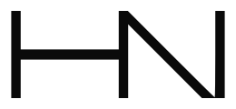

# HANN LABS™

한 걸음 앞선 시선으로, 한 걸음 앞선 트렌드를 디자인하다.
**Designing trends one step ahead.**

 

## What We Do

| 브랜드 | 그래픽 | 캠페인 · 교육 |
|---|---|---|
| 로고 디자인 | 배너 디자인 | 디자인 캠페인 |
| 브랜딩 | 그래픽 디자인 | 디자인 강의 |
| 브랜드 설계 | 포스터 디자인 | — |
| — | 상세페이지 디자인 | — |

## 디자인 철학

**미니멀리즘 × 정교함 × 트렌드**

미니멀리즘을 통해 기억하기 쉬운 시각적 효과를 만들고, 단순하면서도 정교한 디자인으로 시각적 안정감을 주며, 트렌디한 감각으로 새로운 느낌을 담습니다.

## 실적

| 만족도 | 재의뢰율 | 완료 프로젝트 |
|:---:|:---:|:---:|
| **96%** | **90%** | **10+** |

 

Since 2026.03.28 · HANN LABS™

